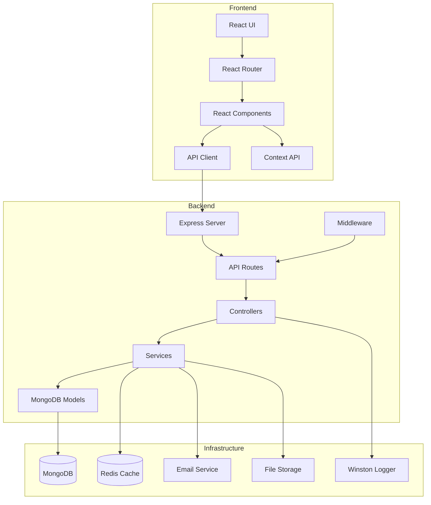
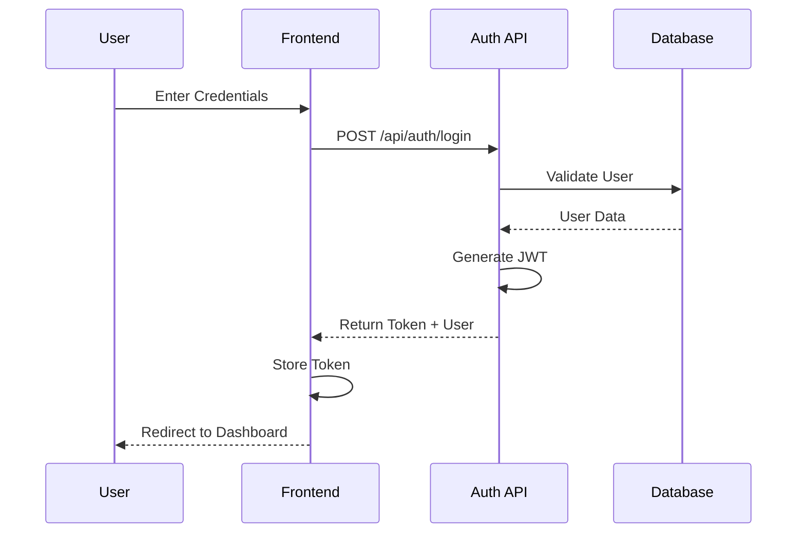
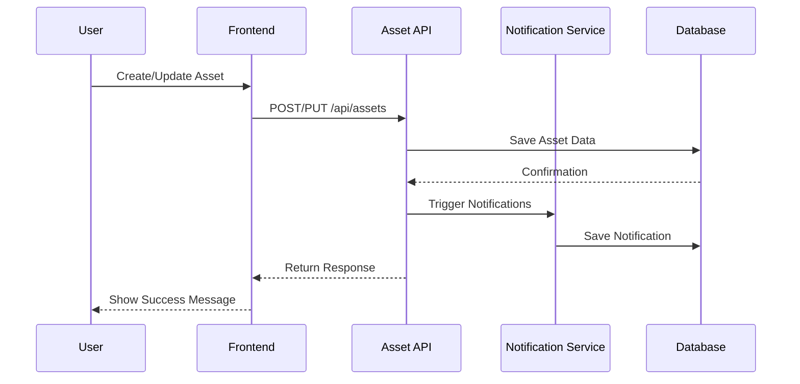
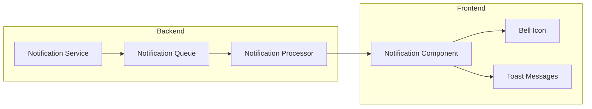
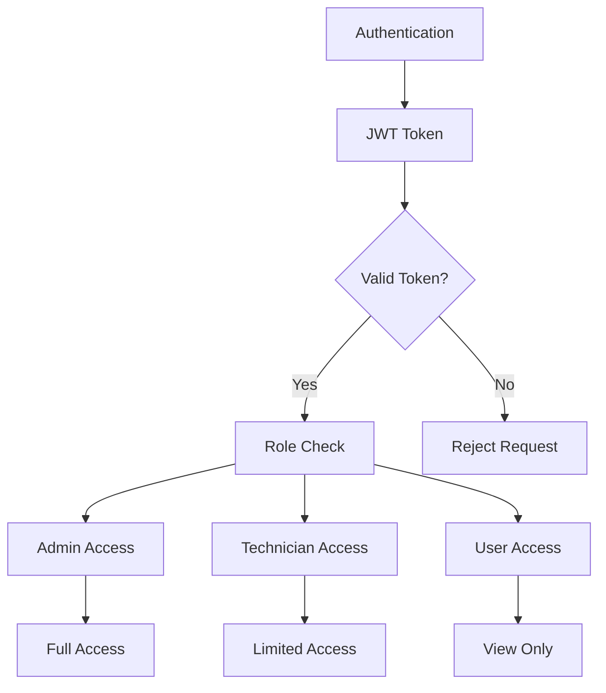
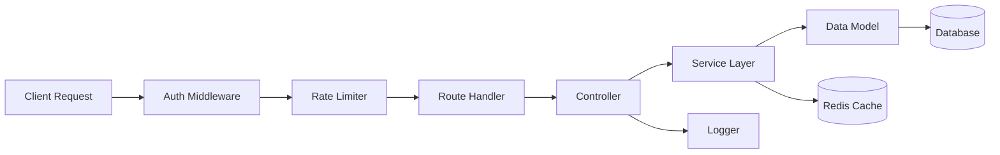

# System Architecture

## Component Architecture Diagram

```mermaid
graph TB
    subgraph Frontend
        UI[React UI]
        Router[React Router]
        API[API Client]
        Components[React Components]
        Context[Context API]
        UI --> Router
        Router --> Components
        Components --> API
        Components --> Context
    end

    subgraph Backend
        Express[Express Server]
        Routes[API Routes]
        Controllers[Controllers]
        Services[Services]
        Models[MongoDB Models]
        Middleware[Middleware]
        
        Express --> Routes
        Routes --> Controllers
        Controllers --> Services
        Services --> Models
        Middleware --> Routes
    end

    subgraph Infrastructure
        MongoDB[(MongoDB)]
        Redis[(Redis Cache)]
        Logger[Winston Logger]
        Email[Email Service]
        Storage[File Storage]
    end

    API --> Express
    Services --> Redis
    Services --> Email
    Models --> MongoDB
    Controllers --> Logger
    Services --> Storage

```

## Authentication Flow

```mermaid
sequenceDiagram
    participant U as User
    participant F as Frontend
    participant A as Auth API
    participant D as Database
    
    U->>F: Enter Credentials
    F->>A: POST /api/auth/login
    A->>D: Validate User
    D-->>A: User Data
    A->>A: Generate JWT
    A-->>F: Return Token + User
    F->>F: Store Token
    F-->>U: Redirect to Dashboard
```

## Asset Management Flow

```mermaid
sequenceDiagram
    participant U as User
    participant F as Frontend
    participant A as Asset API
    participant N as Notification Service
    participant D as Database
    
    U->>F: Create/Update Asset
    F->>A: POST/PUT /api/assets
    A->>D: Save Asset Data
    D-->>A: Confirmation
    A->>N: Trigger Notifications
    N->>D: Save Notification
    A-->>F: Return Response
    F-->>U: Show Success Message
```

## Real-time Notification System

```mermaid
graph LR
    subgraph Backend
        NS[Notification Service]
        NQ[Notification Queue]
        NP[Notification Processor]
    end
    
    subgraph Frontend
        NC[Notification Component]
        NB[Bell Icon]
        NT[Toast Messages]
    end
    
    NS --> NQ
    NQ --> NP
    NP --> NC
    NC --> NB
    NC --> NT
```

## Security Implementation

```mermaid
graph TD
    Auth[Authentication] --> JWT[JWT Token]
    JWT --> Valid{Valid Token?}
    Valid -->|Yes| RBAC[Role Check]
    Valid -->|No| Reject[Reject Request]
    RBAC --> Admin[Admin Access]
    RBAC --> Tech[Technician Access]
    RBAC --> User[User Access]
    Admin --> Full[Full Access]
    Tech --> Limited[Limited Access]
    User --> Restricted[View Only]
```

## Data Flow

```mermaid
graph LR
    Client[Client Request] --> Auth[Auth Middleware]
    Auth --> Rate[Rate Limiter]
    Rate --> Route[Route Handler]
    Route --> Controller[Controller]
    Controller --> Service[Service Layer]
    Service --> Model[Data Model]
    Model --> DB[(Database)]
    Controller --> Log[Logger]
    Service --> Cache[(Redis Cache)]
```