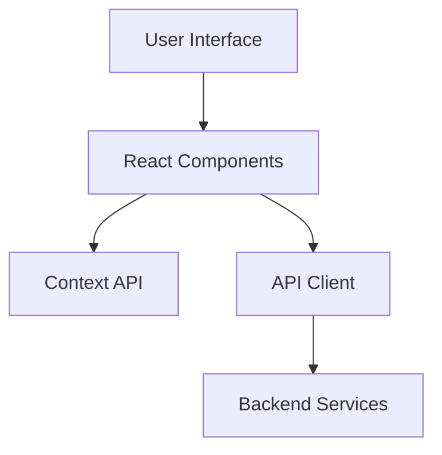
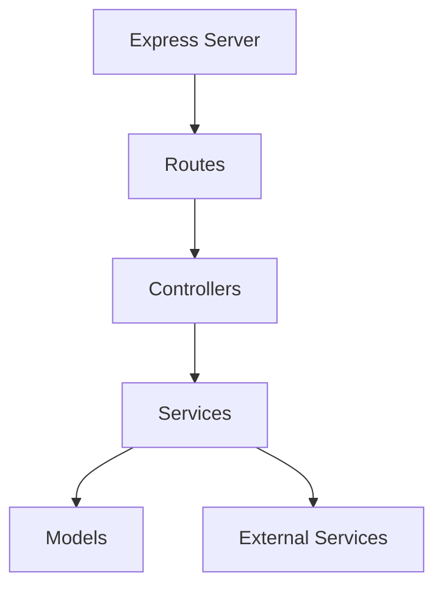

# Software Requirements and Design Document
## IT Asset Management System

## Table of Contents
1. [Introduction](#introduction)
2. [Software Requirements](#software-requirements)
3. [Software Design](#software-design)
4. [Examples and Use Cases](#examples-and-use-cases)
5. [Technical Implementation](#technical-implementation)

## Introduction

The IT Asset Management System is a comprehensive solution designed to streamline the management of organizational assets. This document outlines both the requirements and design specifications with practical examples.

## Software Requirements

### A. Functional Requirements

#### 1. User Management & Authentication

- **Multi-role System**
  - Admin: Full system access and control
  - Technician: Asset maintenance and updates
  - User: Limited to assigned assets
  
- **Authentication Features**
  ```json
  {
    "authentication": {
      "method": "JWT",
      "tokenExpiry": "24h",
      "refreshToken": true,
      "passwordRequirements": {
        "minLength": 8,
        "requireSpecialChar": true,
        "requireNumber": true,
        "requireUppercase": true
      }
    }
  }
  ```

- **Password Recovery Flow**
  ```sequence
  User->System: Request password reset
  System->Email Service: Send reset token
  Email Service->User: Reset link
  User->System: Submit new password
  System->Database: Update password hash
  System->User: Confirmation
  ```

#### 2. Asset Management

- **Asset Lifecycle Management**
  ```json
  {
    "asset": {
      "status": ["Available", "In Use", "Maintenance", "Retired"],
      "trackingFields": {
        "assetTag": "String",
        "serialNumber": "String",
        "purchaseDate": "Date",
        "warrantyExpiry": "Date",
        "maintenanceSchedule": "Array<Date>",
        "assignedUser": "ObjectId",
        "location": "String"
      }
    }
  }
  ```

- **QR Code Integration**
  - Format: Base64 encoded asset information
  - Scan to view/update asset details
  - Mobile-friendly scanning interface

#### 3. Notification System

- **Event Types**
  ```json
  {
    "notifications": {
      "maintenance": {
        "upcoming": "7 days before",
        "due": "On date",
        "overdue": "After due date"
      },
      "warranty": {
        "expiringSoon": "30 days before",
        "expired": "On expiry date"
      },
      "assignment": {
        "new": "Immediate",
        "removed": "Immediate"
      }
    }
  }
  ```

#### 4. Reporting & Analytics

- **Report Types**
  - Asset Status Report
  - Maintenance History
  - User Assignment History
  - Warranty/License Status
  - Audit Logs

### B. Non-Functional Requirements

#### 1. Performance
- Page load time: < 2 seconds
- API response time: < 500ms
- Support for 100+ concurrent users
- Database query optimization

#### 2. Security
```json
{
  "security": {
    "authentication": "JWT",
    "passwordHashing": "bcrypt",
    "rateLimiting": {
      "windowMs": 900000,
      "max": 100
    },
    "cors": {
      "origin": ["trusted-domain.com"],
      "methods": ["GET", "POST", "PUT", "DELETE"]
    }
  }
}
```

## Software Design

### A. System Architecture

#### 1. Frontend Architecture


#### 2. Backend Architecture


### B. Database Schema

#### User Model
```javascript
{
  username: String,
  email: String,
  passwordHash: String,
  role: String,
  resetToken: String,
  resetExpires: Date,
  lastLogin: Date,
  createdAt: Date,
  updatedAt: Date
}
```

#### Asset Model
```javascript
{
  name: String,
  assetTag: String,
  category: String,
  status: String,
  assignedTo: ObjectId,
  location: String,
  serialNumber: String,
  purchaseDate: Date,
  warrantyExpiry: Date,
  maintenanceSchedule: [Date],
  qrCode: String,
  history: [{
    action: String,
    date: Date,
    user: ObjectId,
    notes: String
  }]
}
```

## Examples and Use Cases

### 1. Asset Creation Flow
```sequence
Admin->System: Create new asset
System->Database: Save asset details
System->QR Service: Generate QR code
QR Service->Database: Store QR code
System->Notification: Notify relevant users
System->Admin: Confirmation
```

### 2. Maintenance Schedule
Example of scheduling maintenance:
```json
{
  "assetId": "12345",
  "maintenanceSchedule": {
    "frequency": "monthly",
    "nextDate": "2025-06-05",
    "notifications": {
      "remind": ["7days", "1day"],
      "notifyUsers": ["technician", "admin"]
    }
  }
}
```

### 3. User Assignment
Example of asset assignment:
```json
{
  "action": "assign",
  "assetId": "12345",
  "userId": "67890",
  "notes": "Annual laptop refresh",
  "duration": {
    "start": "2025-05-05",
    "end": "2026-05-05"
  }
}
```

## Technical Implementation

### A. API Endpoints

#### Asset Management
```
GET    /api/assets
POST   /api/assets
GET    /api/assets/:id
PUT    /api/assets/:id
DELETE /api/assets/:id
```

#### User Management
```
POST   /api/auth/login
POST   /api/auth/register
POST   /api/auth/reset-password
GET    /api/users
PUT    /api/users/:id
```

### B. Security Implementation

1. **Authentication Flow**
```sequence
User->Frontend: Login request
Frontend->Backend: POST /api/auth/login
Backend->Database: Validate credentials
Database->Backend: User data
Backend->Frontend: JWT token
Frontend->LocalStorage: Store token
```

2. **Access Control Matrix**
```
Operation       | Admin | Tech | User
----------------|-------|------|------
Create Asset    |   ✓   |   ✗  |   ✗
Edit Asset      |   ✓   |   ✓  |   ✗
View Asset      |   ✓   |   ✓  |   ✓*
Delete Asset    |   ✓   |   ✗  |   ✗
Assign Asset    |   ✓   |   ✗  |   ✗
Generate Report |   ✓   |   ✓  |   ✗

* Users can only view assigned assets
```

### C. Monitoring and Logging

1. **Log Levels**
```javascript
{
  error: "Critical system errors",
  warn: "Important but non-critical issues",
  info: "General operational information",
  debug: "Detailed debugging information"
}
```

2. **Audit Trail Example**
```json
{
  "action": "ASSET_UPDATED",
  "user": "john.doe@company.com",
  "timestamp": "2025-05-05T10:30:00Z",
  "details": {
    "assetId": "12345",
    "changes": {
      "status": ["Available", "In Use"],
      "assignedTo": [null, "67890"]
    }
  }
}
```

## Conclusion

This document serves as a comprehensive guide for the implementation of the IT Asset Management System. All features described above are implemented in the codebase with corresponding frontend components and backend services.